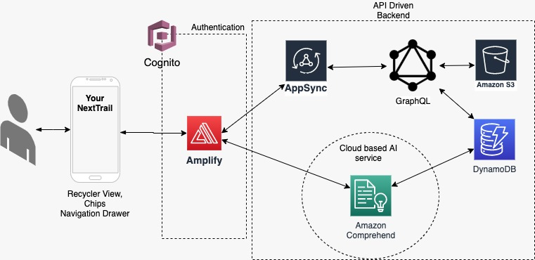

**Introduction**
YourNextTrail is a personalized trail recommendation app. It is an intelligent app which finds out the likes and dislikes of users based on their reviews and recommends them trails based on their likes. It does sentiment analysis on user’s reviews to find out their sentiment about a trail and extract keywords from their reviews to get their favorites and then recommends trails similar to their likings. Users can search for trails and see their level, description and other users' reviews about the trail. They can also delete their reviews with a swipe.

**Features** 
Intelligent app 
Can search for trails
Get Personalized recommendations
Know about their favorites
Sentiment analysis of reviews
Can see their reviews and others reviews with sentiment emoji’s to filter easily
Delete their reviews with swipe
Extracting keywords from reviews to show recommendation
Share trail details to others using any other app
Interactive UI
Cloud backend
API driven backend

**Architecture Diagram**

The App has an AWS Cloud backend. AWS Amplify framework for Android is used to integrate with AWS Services. 
 **Services Used**
AWS Amplify : to integrate with services
Cognito :  user authentication
AppSync : manage GraphQL API’s
GraphQL : Interact with DynamoDB with relational model
Amazon S3 : To store trail images
Amazon Comprehend : AI service for sentiment analysis and text extraction
AWS CloudFormation : to create resources
Github + Amplify : CI/CD setup

Amplify framework for android enables integration of resources with AWS with cloudformation and Continuous Integration. It creates all the required permissions and roles so that resources can invoke each other. For authentication, Cognito’s hosted SignIn UI is used which provides SignUp with email verification and SignIn. Once a user is successfully logged in , their record is saved in DynamoDB through GraphQL  mutation. Users can then search trails, see a list of trails in a place and then can see a detailed view with user reviews and their sentiment emoji’s.The images for the trails are coming from the S3 bucket. If a user wants to write a review they can write , and they can see their review in the lists with the sentiment analysis. For sentiment analysis the review is passed to Comprehend which give a response of the analysis. The review is also passed to get the keywords and it is stored in the DynamoDB . Based on these keywords user’s likings are determined and trails are recommended. 

**App Design**
For UI : 
RecyclerView is used to display trail lists and reviews. Whenever an item is removed or added recyclerview is notified to reflect the change. 
For navigation between screens, bottom navigation drawer is used. 
To display user favorites Chip groups are used.
 For a circular spinner , CircularProgressIndicator is used. 
Floating action button to write reviews. 
Alert box to write a review. 
Glide library to display images from s3 bucket url.
ItemTouchHelper to delete reviews with swipe left or right.
